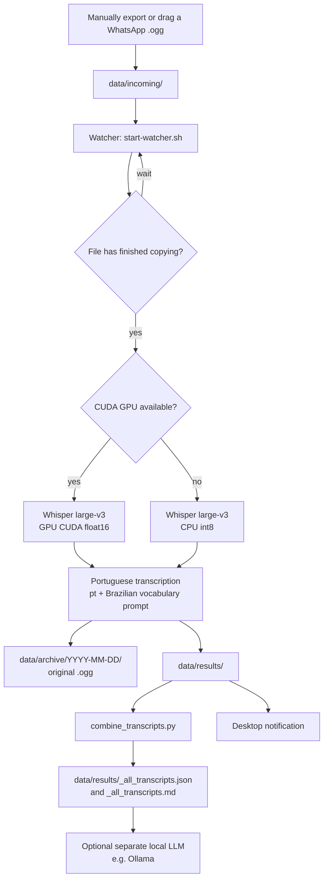

# Local WhatsApp audio transcription

This small local pipeline turns WhatsApp voice notes (`.ogg`) into structured transcripts. It uses Whisper locally and never sends the audio or transcript to an LLM. The JSON output contains a ready-to-use `llm_input` field for a separate LLM step.

## How it works



The watcher checks `data/incoming/` every three seconds and waits until a newly copied file is at least five seconds old. Once transcribed, the original is archived, individual outputs are written, and the consolidated output is rebuilt from every valid individual JSON result. The LLM step is deliberately separate: no audio or text is sent to an LLM by this project unless you choose to do so.

All processing is local after the Whisper model has been downloaded once. The only normal internet access is that one-time model download from Hugging Face.

## Setup

You need Python 3.10+.

```bash
python3 -m venv .venv
source .venv/bin/activate
python3 -m pip install -r requirements.txt
mkdir -p data/incoming
```

The first run downloads the selected Whisper model. The default is `large-v3`, which is the highest-accuracy choice in this workflow; subsequent runs use its local cache.

## Use

For everyday use, start the watcher with one command:

```bash
./bin/start-watcher.sh
```

It creates `data/incoming/` if needed. Drag a WhatsApp `.ogg` into that folder. Once its copy is complete, you receive a desktop notification; the original audio moves to `data/archive/YYYY-MM-DD/` and two outputs appear in `data/results/`:

- `<audio-name>.json`: structured input for another LLM, including `llm_input`.
- `<audio-name>.md`: readable transcript with timestamped segments.

Existing result files are left untouched, so it is safe to restart the watcher. To retain the audio in `data/incoming/`, use the lower-level command with `--keep-source`:

```bash
python3 src/transcribe_audio.py data/incoming --language pt --watch --keep-source
```

After every new transcription, the watcher automatically rebuilds these files from all individual JSON results:

- `data/results/_all_transcripts.md`: a readable, chronological transcript of every audio.
- `data/results/_all_transcripts.json`: LLM-ready data. Send its `llm_input` object, or only `llm_input.transcript`, to your local LLM.

To rebuild the consolidated files manually, including results generated before this feature was added:

```bash
python3 src/combine_transcripts.py
```

The watcher defaults to `large-v3`, Portuguese (`pt`), and a Brazilian-Portuguese vocabulary prompt. It automatically uses CUDA with `float16` when CTranslate2 detects a compatible NVIDIA GPU; otherwise it safely uses CPU with `int8`. The launch log and each JSON result record which device was used.

To override the defaults for one session:

```bash
WHISPER_MODEL=medium WHISPER_DEVICE=cpu ./bin/start-watcher.sh
```

To require CUDA instead of falling back to CPU:

```bash
WHISPER_DEVICE=cuda ./bin/start-watcher.sh
```

If forced CUDA reports no available device, verify that the NVIDIA driver, CUDA 12 libraries, and cuDNN 9 libraries are visible to the terminal that starts the watcher.

The generated JSON is the boundary between transcription and your separate LLM workflow; pass only the `llm_input` object or its `transcript` to the LLM you select.

## Clear local audio data

Stop the watcher first. To permanently remove the contents of `data/archive/`, `data/incoming/`, and `data/results/` while retaining those folders, run:

```bash
python3 src/clear_audio_data.py
```

Type `CLEAR` when prompted. For a non-interactive command, use `python3 src/clear_audio_data.py --yes`.

## Start automatically at login

On this Linux computer, install the user service once:

```bash
./bin/install-autostart.sh
```

It starts the watcher after you sign in and restarts it if it fails. Check its state with `systemctl --user status whisper-audios.service`; stop and remove autostart with `systemctl --user disable --now whisper-audios.service`.
